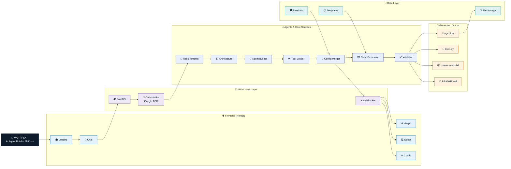
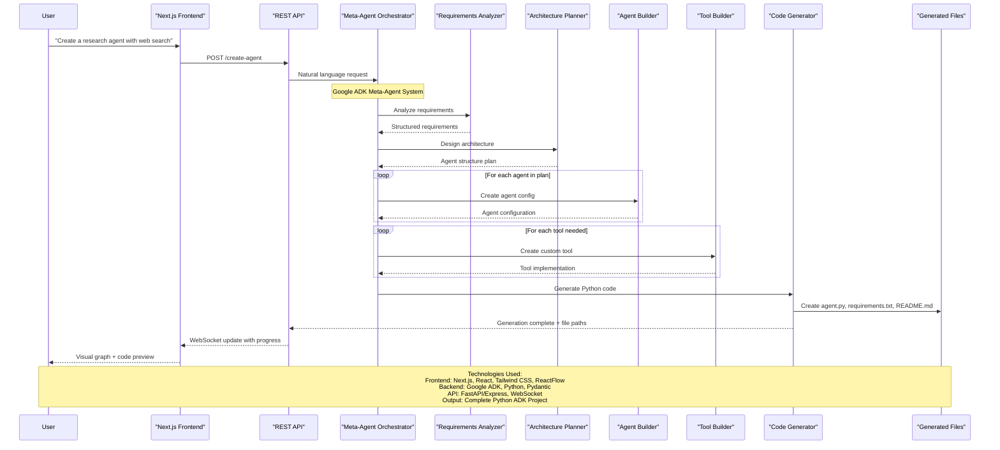

# 🤖 Artifex - AgentBuilder

Artifex is a next-generation AI agent builder that converts natural language requirements into complete, executable multi-agent systems using Google ADK. This project provides both a powerful backend meta-agent system and a modern web interface for creating custom AI agents.


## 🌟 Overview

ArtifexAgentBuilder transforms the complex process of AI agent development into an intuitive, conversation-driven experience. Simply describe what you want your agent to do, and the system will:

- Analyze your requirements
- Design the optimal agent architecture
- Generate complete, production-ready Python code
- Provide a modern web interface for interaction

## 🏗️ Architecture

### System Architecture Overview



### Process Flow & Sequence



## 🚀 Features

### Backend (Meta-Agent System)
- **🧠 Intelligent Analysis**: Natural language requirement extraction
- **🏛️ Architecture Design**: Multi-agent system planning
- **🔧 Custom Tool Creation**: Python function generation with proper error handling
- **📝 Complete Code Generation**: Production-ready agent projects
- **🔄 Session Management**: Persistent configuration throughout creation process
- **✅ Validation & Testing**: Ensures generated agents are functional

### Frontend (Web Interface)
- **💬 Interactive Chat**: Natural conversation with the meta-agent
- **🎨 Visual Agent Designer**: Drag-and-drop agent configuration
- **📊 Agent Graph Visualization**: Real-time architecture visualization
- **💻 Code Editor**: Syntax-highlighted code preview and editing
- **📱 Responsive Design**: Modern, mobile-friendly interface
- **🌙 Dark/Light Mode**: Customizable theme support

## 📁 Project Structure

```
Artifex/
├── agent_generator_with_config/     # Backend Meta-Agent System
│   ├── meta_agent/                  # Core meta-agent implementation
│   │   ├── agent.py                 # Main orchestrator agent
│   │   ├── sub_agents/              # Specialized sub-agents
│   │   ├── tools/                   # Configuration and generation tools
│   │   └── prompts.py               # Agent instruction templates
│   ├── config_schema.py             # Pydantic models for validation
│   ├── code_generator.py            # Config-to-code conversion
│   ├── generated_test_agents/       # Example generated agents
│   └── test_configs.py              # Sample configurations
└── frontend/                        # Next.js Web Application
    ├── app/                         # Next.js app router
    ├── components/                  # React components
    │   ├── agent-chat.tsx           # Chat interface
    │   ├── agent-config.tsx         # Configuration forms
    │   ├── agent-graph.tsx          # Visual graph display
    │   ├── code-editor.tsx          # Code editing interface
    │   └── ui/                      # Reusable UI components
    ├── lib/                         # Utility functions
    ├── types/                       # TypeScript definitions
    └── styles/                      # Global styles
```

## 🛠️ Installation & Setup

### Prerequisites
- Python 3.8+
- Node.js 18+
- pnpm (recommended) or npm

### Backend Setup

1. **Navigate to the backend directory:**
   ```bash
   cd ArtifexAgentBuilder/agent_generator_with_config
   ```

2. **Install Python dependencies:**
   ```bash
   pip install -r requirements.txt
   ```

3. **Set up environment variables (optional):**
   ```bash
   cp .env.example .env
   # Edit .env with your API keys if needed
   ```

4. **Test the meta-agent:**
   ```bash
   python quick_start.py
   ```

### Frontend Setup

1. **Navigate to the frontend directory:**
   ```bash
   cd ArtifexAgentBuilder/frontend
   ```

2. **Install Node.js dependencies:**
   ```bash
   pnpm install
   # or: npm install
   ```

3. **Start the development server:**
   ```bash
   pnpm dev
   # or: npm run dev
   ```

4. **Open your browser:**
   ```
   http://localhost:3000
   ```

## 🎯 Usage Examples

### Backend (Python API)

#### Simple Agent Creation
```python
from meta_agent import root_agent

# Describe your agent
request = """
Create a research assistant that can search the web, 
analyze web pages, and provide well-sourced answers.
"""

# Generate the agent
response = root_agent.run(request)
print(response)
```

#### Complex Multi-Agent System
```python
request = """
Create a customer service system with:
- Intent classification agent
- Product specialist agent  
- Order tracking agent
- Human escalation capability
"""

response = root_agent.run(request)
```

### Frontend (Web Interface)

1. **Open the web application** at `http://localhost:3000`
2. **Start a conversation** with the meta-agent in the chat interface
3. **Describe your agent** in natural language
4. **Review the generated configuration** in the visual graph
5. **Preview and edit code** in the integrated editor
6. **Download your agent** as a complete Python project

## 🔧 Supported Agent Types

- **🤖 LLM Agent**: Single AI agent with tools and custom prompts
- **🔄 Sequential Agent**: Runs sub-agents in ordered sequence
- **⚡ Parallel Agent**: Runs multiple sub-agents simultaneously
- **🔁 Loop Agent**: Repeats sub-agent execution until conditions are met

## 🛠️ Available Tools

### Builtin Tools
- `google_search` - Web search capabilities
- `url_context` - Load and analyze web pages
- `load_memory` - Access stored memories
- `preload_memory` - Load specific memories
- `load_artifacts` - Access saved artifacts
- `transfer_to_agent` - Call other agents
- `get_user_choice` - User interaction prompts
- `exit_loop` - Loop control mechanisms

### Custom Tools
- **Python Functions**: Generate custom tools with proper error handling
- **API Integrations**: Connect to external services and APIs
- **Data Processing**: Create pandas, numpy, and ML-based tools
- **File Operations**: Handle file I/O and data persistence

## 📊 Example Generated Agents

### Research Assistant
```json
{
  "agents": {
    "research_agent": {
      "type": "llm_agent",
      "tools": ["google_search", "url_context"],
      "instruction": "You are a research assistant..."
    }
  }
}
```

### E-commerce Support System
```json
{
  "agents": {
    "intent_classifier": {
      "type": "llm_agent",
      "tools": ["classify_intent"]
    },
    "product_specialist": {
      "type": "llm_agent", 
      "tools": ["product_search", "inventory_check"]
    },
    "orchestrator": {
      "type": "sequential_agent",
      "sub_agents": ["intent_classifier", "product_specialist"]
    }
  }
}
```

## 🔍 Development

### Running Tests
```bash
# Backend tests
cd agent_generator_with_config
python test_enhanced_features.py

# Frontend tests  
cd frontend
pnpm test
```

### Building for Production
```bash
# Frontend production build
cd frontend
pnpm build
pnpm start
```

## 🤝 Contributing

1. Fork the repository
2. Create a feature branch (`git checkout -b feature/amazing-feature`)
3. Commit your changes (`git commit -m 'Add amazing feature'`)
4. Push to the branch (`git push origin feature/amazing-feature`)
5. Open a Pull Request

## 📄 License

This project is licensed under the Apache License 2.0 - see the LICENSE file for details.

## 🙏 Acknowledgments

- Built on Google's Agent Development Kit (ADK)
- Frontend powered by Next.js, React, and Tailwind CSS
- UI components from Radix UI and shadcn/ui
- Code editing with TipTap editor

## 🔗 Links

- [Google ADK Documentation](https://developers.google.com/adk)
- [Next.js Documentation](https://nextjs.org/docs)
- [Project Repository](https://github.com/ManishPrakkash/Artifex)

---

**Made with ☕ for the AI agent development community** 